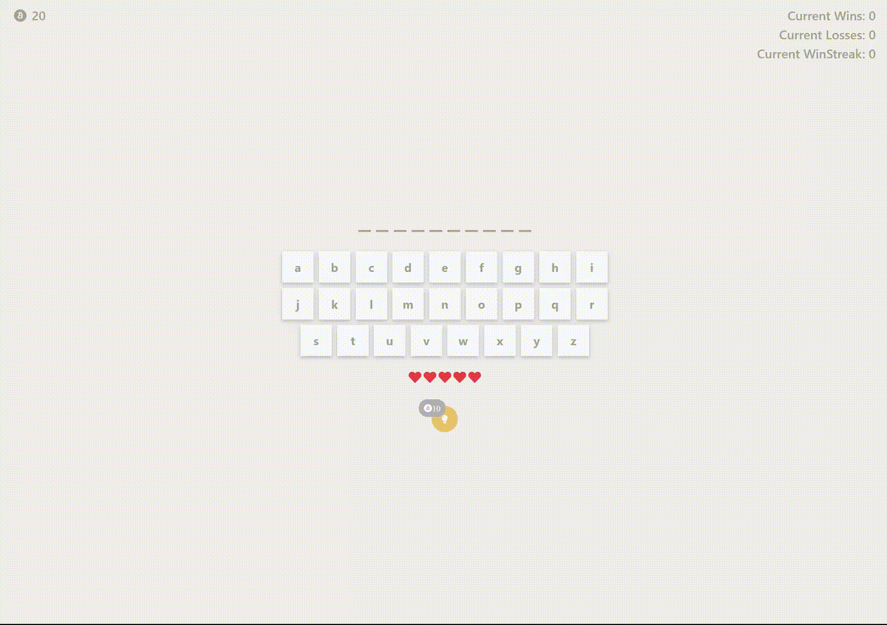

# HangmanProject

## Live Link
[https://aaron-soto.github.io/HangmanProject/](https://aaron-soto.github.io/HangmanProject/)

## Description
- Simply click a letter to make a guess
- You only have 5 guesses until the round is lost and you must guess a new word
- Win and Fail attempts are recorded

## Technologies Used
- HTML/CSS
- JavaScript for DOM manipulation
- Web Fonts (from Google Fonts)
- jQuery for visual effect and TypeIt requires it

## Code Explanation
- Basically, the meat and potatoes of the code is in the JavaScript file (game.js), where the variables and game logic is stored  
- The HTML sets up the basic elements of the game such as the title, pictures and audio, text elements indicating progress and points, etc.  
- The CSS is really the visual aspect of this project, giving the colors and margins, etc. Flexbox was of enormous use in the project (particularly in customizing the scaling of elements)  
- External web fonts, audio, and visual effects were added to spice things up  
